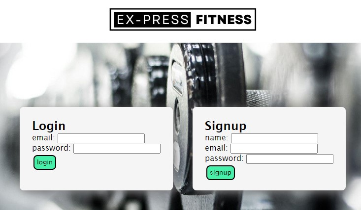

# Ex-Press Fitness
  
  

  ## Description
  One thing average people struggle with when it comes to fitness is getting started or logging their workouts. With Ex-Press Fitness, you'll be able to create your own custom profile that will keep track of exercises the user enters. if the user wanted to filter their results there are buttons to help. All this data can be private and would fall under HIPPA law,meaning it is protected information. Protected Info is important that's why there is also a passcode! The passcode is something that the user creates so only they have access to their data.

  ## Table of Contents
  * [Installation](#installation)
  * [Usage](#usage)
  * [Features](#features)
  * [Links](#links)
  * [Screenshots](#screenshots)
  * [Contributing](#contributing)
  * [Tests](#tests)
  * [License](#license)
  * [Questions](#questions)
  * [Credits](#credits)
  

  ## Installation
  clone the github repo, run 'npm i', run 'source schema.sql', run 'npm run seed', then run 'npm start'

  ## Usage
  saves users exercises sort exercises create custom login with personal passcode.

## Features 
saves users exercises 
sort exercises 
create custom login with personal passcode.

  ## Links

  [Deployed Link](https://floating-beyond-34615.herokuapp.com/)  
  [Github Repository](https://github.com/faye3091/Ex-Press-Fitness)

  ## Screenshots
  
  ### Homepage screenshot
  

  ### Log in / Sign up screenshot
  

  ### Profile screenshot
  

  ## Contributing 
  fork the github repo

  ## Tests
  none

  ## License
   [MIT License](https://opensource.org/licenses/MIT) A short and simple permissive license with conditions only requiring preservation of copyright and license notices. Licensed works, modifications, and larger works may be distributed under different terms and without source code. 

  ## Questions
  Github Profile: [faye3091](https://github.com/faye3091)
   
  Reach me with additional questions at faye_3091@yahoo.com
  
  ## Credits 

[D.J. Balabis](https://github.com/djbalabis) 
[Sebastian Cruz](https://github.com/SebastianCruz01) 
[Jorge Fuster](https://github.com/JorgeFuster) 
[Vanessa Villaluz](https://github.com/faye3091) 
[William Yatsko](https://github.com/Yo1nk)

